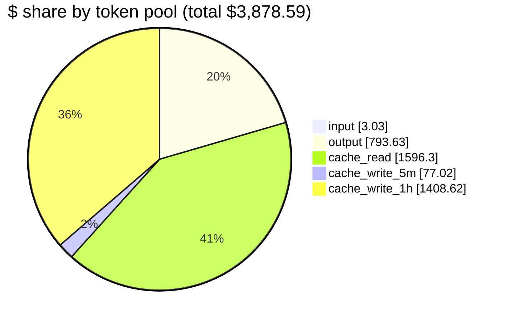
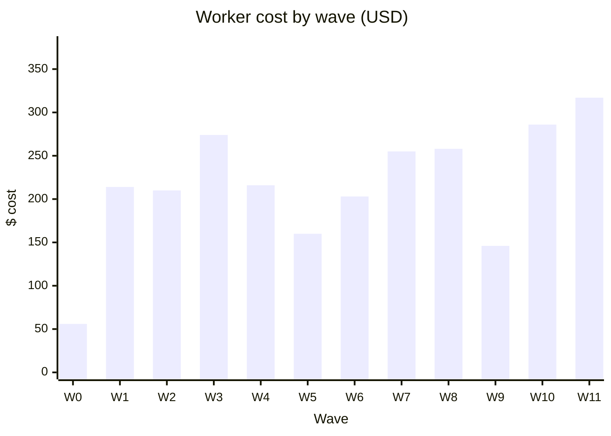

# Cost Rollup

*By Yad Konrad — [@0bserver07](https://github.com/0bserver07)*

Estimated at Opus 4.x public pricing (May 2026): input $15/M, output $75/M, cache_read $1.50/M, cache_write_5m $18.75/M, cache_write_1h $30/M.

## Cost composition

Two pools combine to **77.5%** of the bill — `cache_read` (41%) and `cache_write_1h` (36%). Output is third at 20.5%. Raw input tokens are negligible because the system/tool prompt was almost always cached.

## By pool (orchestrator + 58 workers)

| Pool | Tokens | $/M | Cost | Share |
|---|---:|---:|---:|---:|
| input | 202,129 | $15.00 | $3.03 | 0.1% |
| output | 10,581,714 | $75.00 | $793.63 | 20.5% |
| cache_read | 1,064,199,056 | $1.50 | $1,596.30 | 41.2% |
| cache_write_5m | 4,107,469 | $18.75 | $77.02 | 2.0% |
| cache_write_1h | 46,953,891 | $30.00 | $1,408.62 | 36.3% |
| **total** | **1,126,044,259** | — | **$3,878.59** | 100.0% |

Cache reads are the bulk of tokens but cheap per-token. Output is the conventional cost driver, but on long orchestration sessions like this one, cache_write_1h can match or exceed it.

## By role

| Role | Sessions | Tokens (total) | Cost | $/session |
|---|---:|---:|---:|---:|
| orchestrator | 1 | 487,710,910 | $1,283.73 | $1,283.73 |
| workers | 58 | 638,333,349 | $2,594.86 | $44.74 |
| **total** | **59** | **1,126,044,259** | **$3,878.59** | — |

Orchestrator carries ~33% of total cost despite being a single session, because it holds the long context (full project + tool list + every dispatch result) and gets recomputed many times.

## By wave

| Wave | Slug | Workers | Total turns | Cost | $/worker |
|---:|---|---:|---:|---:|---:|
| 0 | sanity | 1 | 98 | $56.18 | $56.18 |
| 1 | search | 6 | 531 | $213.94 | $35.66 |
| 2 | local-rules | 5 | 503 | $210.31 | $42.06 |
| 3 | rl-hidden-state | 5 | 594 | $273.71 | $54.74 |
| 4 | history-fastweights | 5 | 496 | $215.84 | $43.17 |
| 5 | predictability | 4 | 382 | $159.86 | $39.96 |
| 6 | lstm-1 | 6 | 561 | $202.65 | $33.78 |
| 7 | lstm-2 | 5 | 600 | $254.87 | $50.97 |
| 8 | evolutionary | 4 | 572 | $257.95 | $64.49 |
| 9 | deep-mlps | 4 | 392 | $146.34 | $36.59 |
| 10 | modern | 5 | 642 | $286.19 | $57.24 |
| 11 | v1.5 | 8 | 868 | $317.03 | $39.63 |
| — | **workers total** | **58** | **6239** | **$2,594.86** | — |

Wave 11 (v1.5, 8 heavyweight stubs) and wave 10 (modern, 5 stubs) topped the per-wave cost. Wave 3 (RL hidden state) was unexpectedly expensive per worker — partial-observability environments take more turns to get right.

## Per-wave cost (bar)

## Per-worker cost distribution

- Min: $20.77 (`pole-balance-markov-vac`)
- Median: $41.05
- Mean: $44.74
- Max: $122.05 (`pipe-6-bit-parity`)

Workers built simple stubs in ~$25, complex stubs in ~$90+. The orchestrator is its own outlier at ~$1,283.
