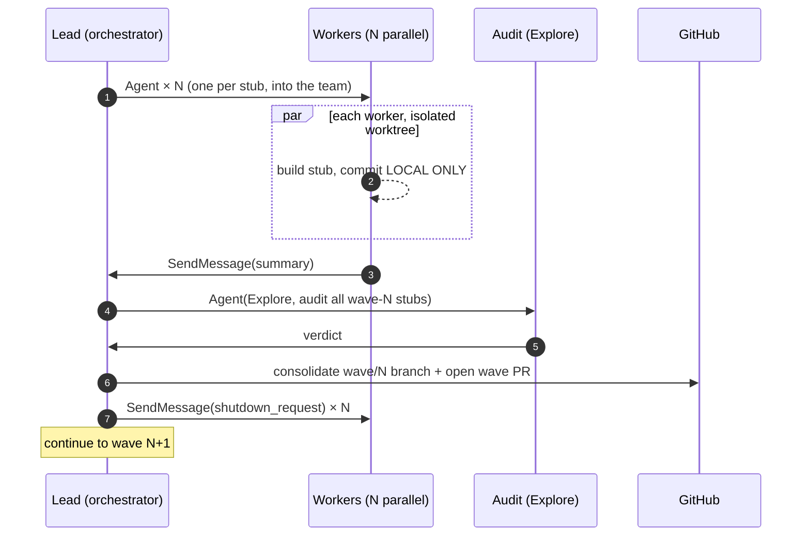

# How to reproduce a build like this

*By Yad Konrad — [@0bserver07](https://github.com/0bserver07)*

A concrete recipe to run a parallel-agent stub catalog of your own. Every step here was used in the actual schmidhuber-problems build; file paths and PR numbers point to verifiable artifacts.

> Prerequisite: Claude Code with the `agent-teams` primitive (`TeamCreate`, `Agent`, `SendMessage`, `TeamDelete`). At time of writing this is Claude Code's tool surface for orchestrator/subagent coordination.

## The forcing-function recipe in 8 steps

### 1. Write a SPEC issue, not a chat message

Before any code, open one GitHub issue that is the contract between you and every worker. Reference: [schmidhuber-problems #1](https://github.com/cybertronai/schmidhuber-problems/issues/1). It defines:

- **Required files per stub** (`<slug>.py`, `README.md`, `make_<slug>_gif.py`, `visualize_<slug>.py`, `<slug>.gif`, `viz/`)
- **8 fixed README sections** (Header / Problem / Files / Running / Results / Visualizations / Deviations / Open questions)
- **Reproducibility rule** — `--seed` exposed via CLI, all hyperparameters in Results, command in §Running reproduces the number
- **10-item acceptance checklist**
- **Constraint that does the most work**: pure numpy + matplotlib only

The SPEC must be one URL. Don't paste rules into chat — they drift.

### 2. Pick a constraint that forces algorithmic faithfulness

In schmidhuber-problems the constraint was **pure numpy + matplotlib**. This sounds restrictive but does the load-bearing work:

- No `torch` shortcuts — workers can't side-step the actual algorithm
- No `gym` environments — RL stubs build numpy mini-environments from scratch
- Deterministic, <5 min/seed on a laptop — anyone can run and verify
- One worker (`linear-transformers-fwp`) ended up **proving the 1992-FWP ≡ 2021-linear-attention equivalence to 2.22e-16** because the constraint left them no place to hide
- One worker (`hq-learning-pomdp`) failed to reproduce the paper's headline. The constraint made the failure visible and honest

Without a strong constraint, agents will paper over hard parts.

### 3. Plan in waves, not individual stubs

Group stubs by **shared infrastructure** so workers in the same wave can lift code from each other. Schmidhuber-problems waves:

| Wave | Family |
|---|---|
| 0 | Sanity (1 stub) |
| 1 | Random search + universal program search (6) |
| 2 | Local rules + world-model controllers (5) |
| 3 | Online RL with hidden state (5) |
| 4 | History compression + fast-weights + self-reference (5) |
| 5 | Predictability min/max + unsupervised features (4) |
| 6 | LSTM canonical battery (BPTT, half 1) (6) |
| 7 | LSTM follow-ups (5) |
| 8 | Evolutionary (4) |
| 9 | Deep MLPs at scale (4) |
| 10 | Object-centric + attention + modern (5) |
| 11 | v1.5 heavyweight-env stubs (8) |

Waves run **sequentially**; workers within a wave run **in parallel**.

### 4. Create one persistent team

```python
TeamCreate(
    team_name="schmidhuber-impl",
    description=(
        "Schmidhuber-problems v1 implementation. Each teammate owns one stub, "
        "works in its own worktree at "
        "/path/to/schmidhuber-problems-waves/wave-N/<stub-slug>/, on branch "
        "wave-N-local/<stub-slug> (LOCAL ONLY, never pushed). Pure numpy + "
        "matplotlib only. SPEC: cybertronai/schmidhuber-problems issue #1. "
        "Lead consolidates per-teammate branches into wave/N-<family> and opens "
        "ONE PR per wave. Lead reviews PRs and merges only on user approval."
    ),
    agent_type="orchestrator",
)
```

Created **once** at the start of the build. Reused for every wave. Don't recreate the team per wave — the team description is your durable contract and you want every dispatch inheriting it for free.

### 5. Per worker: short prompt, long template

Each worker is spawned with `Agent(team_name=..., name=<stub>-builder, ...)`. The first message follows the same template every time. See [Worker prompt anatomy](worker-prompt-anatomy.md) for the dissection. Key load-bearing properties:

- **Identity + mission in one line.** "You are `<name>-builder` on `schmidhuber-impl`. Implement `<stub>` per SPEC issue #1."
- **Context block, 3-4 bullets.** Paper citation. Wave family rules. Reference exemplar from a sibling repo if useful.
- **Deterministic worktree path**: `wave-N/<stub-slug>/`. No coordination needed — the path is computable from `(wave, slug)`.
- **Branch policy in bold**: `wave-N-local/<stub-slug>` (LOCAL ONLY).
- **Protocol contract** (the line that took us a wave to learn): **DO NOT GO SILENT — send a summary explicitly before idling.**
- **Workflow: 6 numbered steps.** No optional items.
- **Edge cases section.** Short-circuits known failure modes.
- **Close**: "You have all tools. Work autonomously." No hedging.

### 6. Per-wave protocol (5 stages)



The audit step is read-only. It uses `Explore` agent type (no edits) and catches inconsistencies before review. Cheap and high-value.

### 7. Batch-merge the wave PRs as the human approval gate

Every wave PR gets opened individually during the build. They are all **merged in one batch** when the human reviews. In schmidhuber-problems this was a 90-second burst on 2026-05-08 15:49:52 → 15:50:36 UTC: PRs #5, #4, #6, #7, #8, #9, #10, #11, #12, #13, #14, #15, #16 (meta) merged in order.

The batch-merge is your last chance to spot something. Don't auto-merge.

### 8. Ship the catalog

After all wave PRs merge, one meta PR:

- mdBook config (`book.toml`)
- Top-level docs (`BUILD_NOTES.md`, `RESULTS.md`, `VISUAL_TOUR.md`, catalog README)
- GitHub Pages workflow
- The site goes live within minutes

Reference: [PR #16](https://github.com/cybertronai/schmidhuber-problems/pull/16).

## Costs to budget

Estimate per the schmidhuber data (58 stubs):

- **Orchestrator session**: ~\$1,283 (40 Yad-typed prompts, 1,026 assistant turns over ~21 active hours of attention spread across 41 wall hours)
- **Per worker**: median \$41, range \$21-\$122 (one outlier — `pipe-6-bit-parity` hit a tricky LSTM training issue)
- **Per wave**: \$146 (deep-mlps, simple) to \$317 (v1.5, heavyweight)
- **Total**: \$3,879 at Opus 4.x public pricing

Token mix matters more than you'd think:

| Pool | $ share |
|---|---:|
| `cache_read` | 41% |
| `cache_write_1h` | 36% |
| `output` | 20.5% |
| `input` | 0.1% |
| `cache_write_5m` | 2% |

**`cache_write_1h` is the silent driver** — every time the orchestrator's long context invalidates, it pays \$30/M to re-cache. Tighter tool-list discipline could cut this.

## Things to skip

- **Don't open a PR per stub.** It's branch spam. We learned this with wave 1 (PR #2 had to be closed and reissued as PR #5).
- **Don't push branches from workers.** Use LOCAL ONLY. The orchestrator owns the push + PR step.
- **Don't have workers wait for human approval mid-build.** That's what the SPEC + audit is for. One human-approval gate at the end (the batch merge) is enough.
- **Don't try to do "ambitious" stubs in v1.** Heavyweight-env stubs (TIMIT, IAM, ISBI, CarRacing, VizDoom, TORCS) all went into a separate wave 11 / "v1.5" with numpy synthetic substitutes documented as deviations.
- **Don't ask the workers to write the BUILD_NOTES.** The orchestrator extracts BUILD_NOTES from its own JSONL session log at the end. Anything else gets prose-from-memory hallucinations.

## Verifying the recipe ran

Counts to check against any reproduction:

- `TeamCreate` × 1, `TeamDelete` × 1, `Agent` × ~70, `SendMessage` × ~70 in the orchestrator's JSONL
- One PR per wave, opened in order
- One audit comment per PR (from the per-wave Explore subagent)
- All stubs ≤ 5 min/seed wallclock, deterministic at `--seed 0`

If any of these is wildly off, something drifted from the recipe.

## Lineage

This recipe was first run on **hinton-problems** in 2026-05-01 → 2026-05-03 (53 stubs, ~30 wall hours). The schmidhuber-problems build refined the protocol (LOCAL-ONLY branches, explicit summary-or-shutdown). Both are pure-numpy, mdBook-published, parallel-agent catalogs of paper benchmarks.
