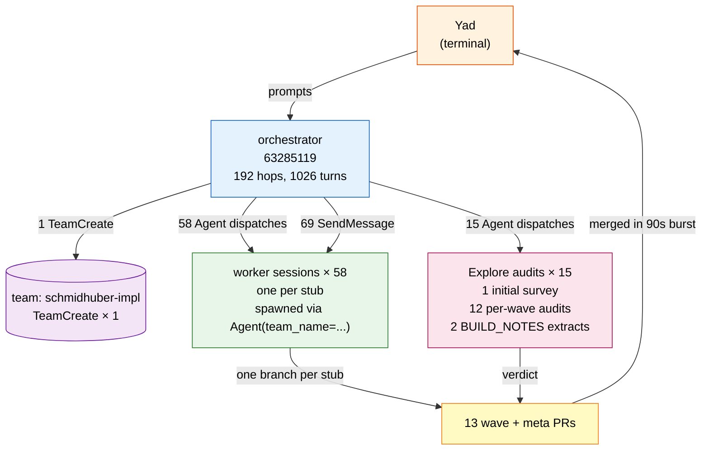
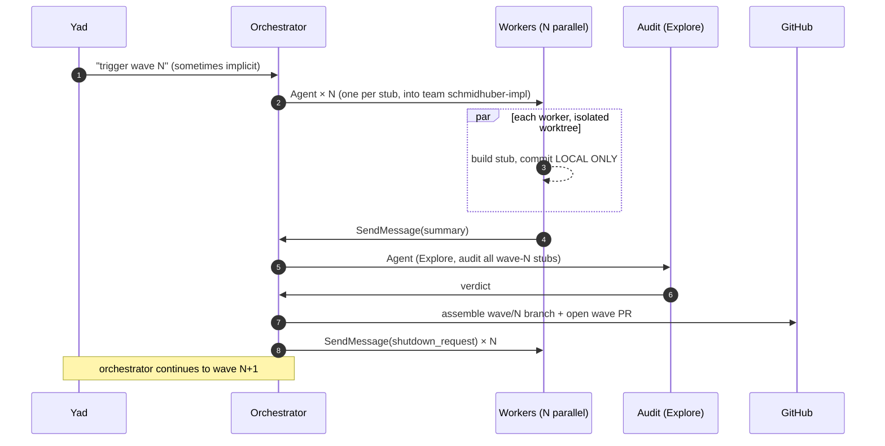

# Orchestration Map

Hierarchy of sessions and the wave-by-wave timeline.

## Topology

The orchestrator created **one persistent team** (`schmidhuber-impl`) via `TeamCreate` and routed work to teammates via `Agent(team_name=schmidhuber-impl, name=<stub>-builder, ...)` calls. The orchestrator's `SendMessage` calls were used to nudge specific teammates mid-build.

- TeamCreate calls in orchestrator: **1**
- Agent dispatches: **73**
- SendMessage calls: **69**
- TaskCreate / TaskUpdate (orchestrator's own todo tracking): **15** / **34**

## Wave-by-wave timeline (UTC)

| Wave | First dispatch | Audit dispatch | PR# | Stubs | Branch |
|---:|---|---|---:|---:|---|
| 0 | 2026-05-06T23:24:21.197Z | 2026-05-07T00:15:58.700Z | #5 | 1 | `wave/0-sanity` |
| 1 | 2026-05-07T00:20:49.759Z | 2026-05-07T01:24:52.413Z | #4 | 6 | `wave/1-search` |
| 2 | 2026-05-07T01:57:22.480Z | 2026-05-07T02:27:42.630Z | #6 | 5 | `wave/2-local-rules` |
| 3 | 2026-05-07T02:54:14.044Z | 2026-05-07T12:12:09.103Z | #7 | 5 | `wave/3-rl-hidden-state` |
| 4 | 2026-05-07T12:18:25.759Z | 2026-05-07T12:45:58.740Z | #8 | 5 | `wave/4-history-fastweights` |
| 5 | 2026-05-07T12:50:32.923Z | 2026-05-07T13:12:16.581Z | #9 | 4 | `wave/5-predictability` |
| 6 | 2026-05-07T13:16:59.339Z | 2026-05-07T13:53:02.568Z | #10 | 6 | `wave/6-lstm-1` |
| 7 | 2026-05-07T14:34:45.731Z | 2026-05-07T15:17:29.533Z | #11 | 5 | `wave/7-lstm-2` |
| 8 | 2026-05-07T15:29:33.223Z | 2026-05-07T16:54:46.185Z | #12 | 4 | `wave/8-evolutionary` |
| 9 | 2026-05-07T16:58:19.924Z | 2026-05-07T17:19:01.054Z | #13 | 4 | `wave/9-deep-mlps` |
| 10 | 2026-05-07T17:23:08.529Z | 2026-05-07T18:04:56.192Z | #14 | 5 | `wave/10-modern` |
| 11 | 2026-05-08T13:56:34.013Z | 2026-05-08T14:44:48.020Z | #15 | 8 | `wave/11-v1.5` |

## One wave, sequenced

Every wave followed the same protocol:
1. Orchestrator emits N parallel `Agent` calls (one per stub) into the `schmidhuber-impl` team.
2. Workers each build their stub in a sandboxed worktree.
3. After workers finish, orchestrator launches one `Explore` audit agent that reads all stubs and flags inconsistencies.
4. Orchestrator opens the wave PR.
5. Move to the next wave.

The interesting bit: PRs were all merged in a tight burst on 2026-05-08 15:49–15:50 UTC, *after* every wave was built and audited. The build itself ran across 2026-05-06 23:09 → 2026-05-08 14:51 UTC, ~40 hours wall-clock.

## Sidechain note

The orchestrator session has **0 sidechain turns**: in-process subagent traffic (mostly the `Explore` agent reads). Worker sessions appear as separate JSONLs in the project directory because `agent-teams` spawns them as distinct Claude Code instances, even though their `cwd` is still `SutroYaro/`.
