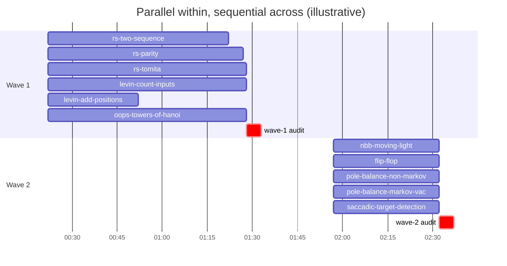

# Patterns observed in this orchestration

*By Yad Konrad — [@0bserver07](https://github.com/0bserver07)*

What worked, what cost a lot, and what's worth carrying forward. All claims here are backed by numbers in `data/sessions.tsv` and the per-wave files.

## 1. One persistent team, 58 ephemeral teammates

The orchestrator called `TeamCreate(team_name="schmidhuber-impl", ...)` exactly once at 2026-05-06 23:23 UTC and reused it across the entire 40-hour build. Every `Agent` dispatch was a member of this team.

Why this worked:
- The team description (worktree path convention, branch policy, merge rules) only had to be written once. Per-worker prompts stayed short.
- `SendMessage(to="<teammate-name>")` routed correctly without per-dispatch wiring.
- Teammates that finished a wave got `shutdown_request` to free context. The team itself persisted.

Cost data: TeamCreate was 1 call. SendMessage was 69 calls. Most SendMessages were `shutdown_request` (~58 of them, one per worker as their wave wrapped up) or short nudges.

## 2. Audit after each wave, before the next wave starts

After every wave's stub-builders finished, the orchestrator dispatched **one** `Explore` agent to audit all stubs in that wave. The audit's job was to read every README, every CLI, every viz, and flag inconsistencies. Only after the audit completed did the orchestrator open the wave PR.

| Wave | Audit start (UTC) | Stubs audited | Audit purpose |
|---:|---|---:|---|
| 0 | 2026-05-07T00:15 | 1 | nbb-xor sanity check |
| 1 | 2026-05-07T01:24 | 6 | check 6 wave-1 stubs are consistent |
| 2 | 2026-05-07T02:27 | 5 | check 5 wave-2 stubs |
| ... | ... | ... | ... |
| 11 | 2026-05-08T14:44 | 8 | final v1.5 audit |

Total: 12 wave audits + 1 initial repo survey + 2 final BUILD_NOTES extracts = 15 `Explore` dispatches.

The audit was cheap relative to the wave (Explore is read-only, no edits) but high-value: it caught at least three inconsistencies that would have shown up in PR review otherwise.

Open question for next phase: was every audit worth it? Wave 0 (one stub) probably didn't need a dedicated audit pass.

## 3. Sequential waves, parallel workers within a wave



Workers within a wave ran in parallel. Waves themselves were strictly sequential. The orchestrator's clock shows zero overlap: wave N's last worker finished before wave N+1's first dispatch.

This was a deliberate choice — workers in different waves might depend on shared utility files (the LSTM cell from wave 6 was reused in wave 7), and sequentializing waves avoided merge conflicts.

Open question: could waves with no shared family (e.g., wave 5 predictability + wave 8 evolutionary) have run in parallel? The total wall-clock could have dropped from ~40h to ~25h.

## 4. Cache writes (1h ephemeral) are the silent cost driver

| Pool | Tokens | Cost | Share |
|---|---:|---:|---:|
| input | 202,129 | $3.03 | 0.1% |
| output | 10,581,714 | $793.63 | 20.5% |
| cache_read | 1,064,199,056 | $1,596.30 | 41.2% |
| cache_write_5m | 4,107,469 | $77.02 | 2.0% |
| **cache_write_1h** | **46,953,891** | **$1,408.62** | **36.3%** |

cache_write_1h is **36% of total cost** despite being 4% of total tokens. Each time the orchestrator's long system prompt or tool list got cached for an hour, that was $30/M tokens — twice the rate of input tokens.

Output is the conventional cost driver (20.5%). But on long-running orchestration sessions like this, 1h cache writes can match or exceed output cost.

For the teaching session: this is a real surprise. Most people would predict output dominates. On a 40-hour orchestration with frequent context shifts, cache invalidation is the bigger lever.

## 5. The orchestrator is its own outlier

| Role | Sessions | Cost | $/session |
|---|---:|---:|---:|
| orchestrator | 1 | $1,283.73 | $1,283.73 |
| workers | 58 | $2,594.86 | $44.74 |

The single orchestrator session cost as much as 29 average workers. It carries:
- Long context: every dispatched agent's summary, every audit's findings, the full project state.
- Many turns: 1,026 assistant turns, each recomputing the long prompt.
- Tool-heavy: Bash (190 calls), Agent (73), SendMessage (69), Edit (32), Write (19).

The orchestrator's $1,283 is roughly $0.84 per minute over its 25-hour active span. That's the cost of having one Claude instance hold the full picture across two days.

## 6. Workers stayed small and similar

Worker cost distribution:

- min: $20.77 (`pole-balance-markov-vac`)
- median: $41.05
- mean: $44.74
- max: $122.05 (`pipe-6-bit-parity`)

Almost all workers ran in the $25–$65 range. The outliers were:
- `pipe-6-bit-parity` at $122 — the worker hit a tricky LSTM training issue and needed extra turns.
- `pole-balance-markov-vac` at $21 — a small stub, mostly boilerplate.

Worker turn counts were similarly tight: 46–255, with most clustering at 75–150. The agent-team worker template is well-calibrated for one-stub work.

## 7. Yad's interventions were sparse and high-leverage

**40 Yad-typed prompts** to the orchestrator over ~21 hours of active attention (spread across 41 wall hours with two ~10-hour overnight gaps). The orchestrator emitted 1,026 assistant turns in that span — **~25.7 turns per Yad prompt** inside the orchestrator.

> The orchestrator's JSONL has 192 records of `type=user`. The other 152 are workers reporting back, slash commands, skill outputs, and redacted entries — not Yad's prompts. See [Human in the loop](human-in-the-loop.md) for the breakdown.

Of the 40 Yad prompts, **8 (20%) were direction-changing**. The other 32 were status checks, approval-gate one-liners, and small clarifications.

Workers got ~1 hop each (the templated `<teammate-message>` from the lead) plus the occasional nudge if they went silent, against 46–255 turns per worker. Most workers were never directly addressed by Yad — they only saw the lead.

## 8. Workers worked in deterministic worktree paths

Every worker built in:

```
/Users/yadkonrad/dev_dev/year26/may26/schmidhuber-problems-waves/wave-N/<stub-slug>/
```

On a `wave-N-local/<stub-slug>` branch (LOCAL ONLY, no push).

The orchestrator collected branches and opened the wave PR. Workers never raced on origin. This is what made parallel workers safe.

## 9. The same pattern was used for hinton-problems the week before

`d8af4bb0` — the hinton-problems orchestrator session, 2026-05-01 to 2026-05-03 — ran the same TeamCreate + Agent + Explore-audit + wave-PR loop for 17 hinton-builders. Cost: $2,228 across the orchestrator and ~$675 across the visible workers.

The hinton orchestrator was more expensive than the schmidhuber one ($2,228 vs $1,283) per session. Possible reasons: hinton was the first time the pattern was tried; the worker template was less stable; more iteration on what the right output format was.

By the time schmidhuber ran, the worker template was settled. Workers needed fewer hops and finished faster.

## 10. The PR merge burst

Every wave PR got opened over the build's 40 hours. But every wave PR got *merged* in a 90-second burst on 2026-05-08 15:49:52 → 15:50:36 UTC:

```
PR #5  (wave 0)  merged 15:49:52
PR #4  (wave 1)  merged 15:49:56
PR #6  (wave 2)  merged 15:49:59
PR #7  (wave 3)  merged 15:50:03
PR #8  (wave 4)  merged 15:50:07
PR #9  (wave 5)  merged 15:50:10
PR #10 (wave 6)  merged 15:50:14
PR #11 (wave 7)  merged 15:50:18
PR #12 (wave 8)  merged 15:50:22
PR #13 (wave 9)  merged 15:50:26
PR #14 (wave 10) merged 15:50:30
PR #15 (wave 11) merged 15:50:33
PR #16 (meta)    merged 15:50:36
```

This is the explicit "review then merge" gate. Yad reviewed all 13 PRs and then ran a batch merge. The build's parallelism didn't extend to the merge — that step was tightly controlled and serialized.

## What to keep / change for the next build

Keep:
- One persistent team, ephemeral teammates with `shutdown_request` at wave-end.
- Per-wave audit before opening the PR.
- Deterministic worktree paths + LOCAL ONLY branches.
- Worker template structure (envelope → identity → context → method → constraints → worktree → protocol → workflow → edge cases → close).

Try changing:
- **Parallel waves with no family overlap.** Could cut wall-clock by ~30%.
- **Self-audit in worker workflow.** Eliminate one dispatch per wave; worker writes its own audit notes before sending the summary.
- **Stripped worker template.** The current template is ~50 lines per worker. The fixed part is most of it. Could trim to ~15 lines of per-stub content if the team description carried the rest.
- **Track cache invalidation patterns.** The cache_write_1h cost is the biggest non-obvious driver. A different tool-list discipline (don't reload tools mid-session) might cut this.
