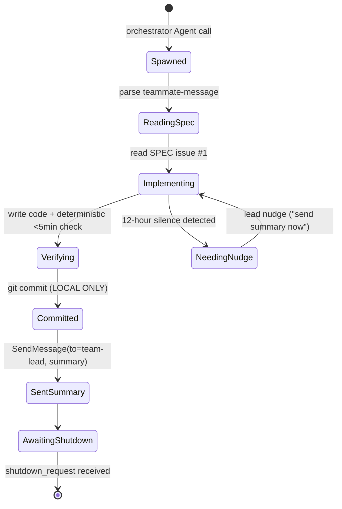

# Anatomy of a Worker Prompt

*By Yad Konrad — [@0bserver07](https://github.com/0bserver07)*

One worker's first prompt, annotated. This is the actual message the orchestrator sent to spawn `adding-problem-builder` (wave 6, session `19f9d639`).

## On this page

- [Worker lifecycle](#worker-lifecycle) — state diagram of how a worker progresses from spawn to shutdown
- [The full prompt](#the-full-prompt) — the whole template (collapsed by default)
- [Section-by-section](#section-by-section) — what each part of the template does and why
- [The TeamCreate setup](#the-teamcreate-setup) — the team contract every worker inherits
- [Worker → lead messaging](#worker--lead-messaging) — how workers report back and get torn down
- [Why this template held up](#why-this-template-held-up) — six properties that made it reusable

## Worker lifecycle



A clean worker run is the top path: spawn → read → build → commit → summary → shutdown. The bottom path is the recovery branch: when a worker went silent after committing, the lead nudged it with "send your summary now" (visible in 3 wave-3 sessions).

## The full prompt

The full template as the worker received it. Click to expand — the section-by-section breakdown below is the part worth reading sequentially.

<details>
<summary>Show the full <code>&lt;teammate-message&gt;</code></summary>

```
<teammate-message teammate_id="team-lead">
You are `adding-problem-builder` on `schmidhuber-impl`. Implement **adding-problem** per SPEC issue #1.

## Context
- SPEC: https://github.com/cybertronai/schmidhuber-problems/issues/1 — read FIRST.
- Reference paper: Hochreiter & Schmidhuber 1997, *Long Short-Term Memory* (NC 9(8)), Experiment 4 (the "adding problem"). The first non-trivial LSTM benchmark.
- Wave 6 family: LSTM canonical battery (BPTT). All wave-6 stubs use the same LSTM cell + BPTT infra. **Algorithmic faithfulness rule**: implement actual LSTM (forget gate may be added, paper used vanilla LSTM without forget gate; document choice in §Deviations).
- Reference exemplar: cybertronai/hinton-problems/encoder-4-2-4.

## Method-specific guidance — Adding Problem (Experiment 4)
Task:
- Sequence of length T (paper sweeps T = 100, 500, 1000).
- At each step: 2-D input. Channel 0: random real in [-1,1]. Channel 1: 0 or 1 marker (exactly 2 markers per sequence — one in first half, one in second half).
- Target at last step: sum of the 2 marked values.
- Loss: MSE.

Architecture: LSTM with forget gate (or original 1997 cell), small hidden size (paper used 2-8 units), BPTT.

Headline: "LSTM solves T=N adding problem in M sequences; vanilla RNN with same arch fails (gradient vanishes)."

## Constraints
- **Pure numpy + matplotlib only.** Reproducibility, deterministic, <5 min.

## Worktree
- Path: `/Users/yadkonrad/dev_dev/year26/may26/schmidhuber-problems-waves/wave-6/adding-problem`
- Branch: `wave-6-local/adding-problem` (LOCAL ONLY)

## 🚨 PROTOCOL 🚨
**DO NOT PUSH. SEND SUMMARY MESSAGE TO `team-lead` BEFORE IDLING.** Don't go silent — send a summary explicitly.

## Workflow
1. Read SPEC.
2. Read existing stub.
3. Implement in `adding-problem/`:
   - `adding_problem.py` — LSTM cell + train + eval + CLI (`--seed --T --hidden`).
   - `README.md` — 8 sections.
   - `make_adding_problem_gif.py` + `visualize_adding_problem.py` + `viz/`.
   - `adding_problem.gif` (≤2 MB).
   - Remove `problem.py`.
4. Verify deterministic <5 min.
5. Commit LOCAL ONLY (DO NOT PUSH).
6. Send summary to `team-lead`.

## Edge cases
- 1997 NC paper retrievable. Hochreiter's diploma 1991 (German) covers earlier vanishing-gradient analysis.
- Manual BPTT through LSTM is tricky — gradient check (numerical vs analytical) is highly recommended.
- T=100 reasonable for v1; document if you reduce.
- Vanilla RNN baseline: same arch but with simple-recurrent-cell instead of LSTM. Expected: fails at T≥50.

You have all tools. Work autonomously.
</teammate-message>
```

</details>

## Section-by-section

### Envelope

```
<teammate-message teammate_id="team-lead">
...
</teammate-message>
```

The `<teammate-message>` tag tells the worker who the message is from. Workers respond back to `team-lead` via `SendMessage(to="team-lead")`. The tag is a convention enforced by the `agent-teams` machinery — it's how multi-agent traffic gets routed.

### Identity + mission (one line)

```
You are `adding-problem-builder` on `schmidhuber-impl`. Implement **adding-problem** per SPEC issue #1.
```

- **Teammate name** matches the `name=` argument to the orchestrator's `Agent()` call.
- **Team name** matches the `team_name=` argument and pins the worker to a specific `TeamCreate` session.
- **Mission** is one verb + one object. No prologue.

### Context block

```
## Context
- SPEC: ... — read FIRST.
- Reference paper: ...
- Wave 6 family: ... All wave-6 stubs use the same LSTM cell + BPTT infra. **Algorithmic faithfulness rule**: ...
- Reference exemplar: cybertronai/hinton-problems/encoder-4-2-4.
```

Four bullets, each loadbearing:
1. **SPEC link** — points to a single, durable issue containing the canonical spec. "Read FIRST" is the load-bearing word.
2. **Reference paper** — exact citation, including which experiment number.
3. **Family** — what other waves/stubs this is grouped with. The "algorithmic faithfulness rule" is the family-level constraint.
4. **Exemplar** — a previously-built stub in a sibling repo that the worker can read for stylistic/architectural cues.

### Method-specific guidance

The actual task definition. Inputs, targets, loss, architecture, expected headline result. Written like a paper-results paragraph: "LSTM solves T=N adding problem in M sequences; vanilla RNN with same arch fails (gradient vanishes)."

### Constraints

```
- **Pure numpy + matplotlib only.** Reproducibility, deterministic, <5 min.
```

The constraint is on the *output*, not the *method*. The worker can use whatever tools internally; the artifact must be numpy-only and run in 5 min deterministically.

### Worktree

```
- Path: `/Users/yadkonrad/dev_dev/year26/may26/schmidhuber-problems-waves/wave-6/adding-problem`
- Branch: `wave-6-local/adding-problem` (LOCAL ONLY)
```

This is the key isolation mechanism: each worker gets its own git worktree at a deterministic path, on a LOCAL-ONLY branch. The "LOCAL ONLY" stops workers from racing to push to origin. The orchestrator collects branches and assembles the wave PR.

### Protocol

```
## 🚨 PROTOCOL 🚨
**DO NOT PUSH. SEND SUMMARY MESSAGE TO `team-lead` BEFORE IDLING.**
```

Two rules:
- Don't push (orchestrator owns the PR).
- Send a closing summary message. Don't go silent.

The "before idling" phrasing matters: a worker that finishes work and just stops without sending a `SendMessage(to=team-lead, ...)` is invisible to the orchestrator. The orchestrator has to poll.

### Workflow

```
1. Read SPEC. 2. Read existing stub. 3. Implement in <slug>/: ... 4. Verify ... 5. Commit LOCAL ONLY. 6. Send summary to team-lead.
```

Numbered. Six steps. No optional steps. No "if applicable" hedging.

### Edge cases

```
- 1997 NC paper retrievable. ...
- Manual BPTT through LSTM is tricky — gradient check ... is highly recommended.
- T=100 reasonable for v1; document if you reduce.
- Vanilla RNN baseline: ... Expected: fails at T≥50.
```

The orchestrator wrote these from familiarity with the paper. They short-circuit the most common failure modes a builder would otherwise hit.

### Close

```
You have all tools. Work autonomously.
```

One line. No "good luck", no "let me know if you need anything." The worker has tools, has a spec, has constraints. Go.

## The TeamCreate setup

Before any worker was dispatched, the orchestrator called `TeamCreate` once:

```json
{
  "team_name": "schmidhuber-impl",
  "description": "Schmidhuber-problems v1 implementation. Each teammate owns one stub, works in its own worktree at /Users/yadkonrad/dev_dev/year26/may26/schmidhuber-problems-waves/wave-N/<stub-slug>/, on branch impl/<stub-slug> (branched from origin/main). Pure numpy + matplotlib only — no torch/gym/scipy unless justified. SPEC: cybertronai/schmidhuber-problems issue #1. Lead is the SutroYaro session at /Users/yadkonrad/dev_dev/year26/feb26/SutroYaro. Lead consolidates per-teammate branches into wave/N-<family> and opens ONE PR per wave (not per stub). Lead reviews PRs and merges only on Yad's explicit approval.",
  "agent_type": "orchestrator"
}
```

This is the **persistent team contract**. Every Agent dispatch into `schmidhuber-impl` inherits this description; the worker's first prompt only carries the per-stub specifics.

The contract is precise about boundaries:
- Workers own their worktree path and branch
- Workers don't push to origin
- The lead (orchestrator) does the wave consolidation
- Merges require Yad's explicit approval

## Worker → lead messaging

After finishing, workers `SendMessage(to="team-lead", message="...")` with a summary. The orchestrator's first response was often a shutdown:

```json
{
  "to": "nbb-xor-builder",
  "message": {
    "type": "shutdown_request",
    "reason": "Wave 0 complete. PR #2 opened with audit. Thank you — solid work. Shutting down to free context for wave 1."
  }
}
```

Context-freeing was deliberate. Each wave's workers were torn down after their PR landed, so the orchestrator's context wasn't bloated by 58 simultaneous teammate transcripts.

## Why this template held up

Six properties made the worker prompt reusable across 58 builders:

1. **Single SPEC link** as the source of truth. Workers always read the spec first.
2. **Family-level rules** factored out from per-stub rules. Wave 6 says "all wave-6 stubs use the same LSTM cell" once; it's not repeated in 6 worker prompts.
3. **Worktree path is deterministic.** No coordination needed — the path is computable from `wave-N/stub-slug`.
4. **LOCAL ONLY** as the default branch policy. Workers can't accidentally race each other in origin.
5. **One protocol rule per line.** "Don't push." "Send a summary." Easy to follow, easy to violate visibly.
6. **No hedging language.** "You have all tools. Work autonomously." not "Please use your best judgment to..."
